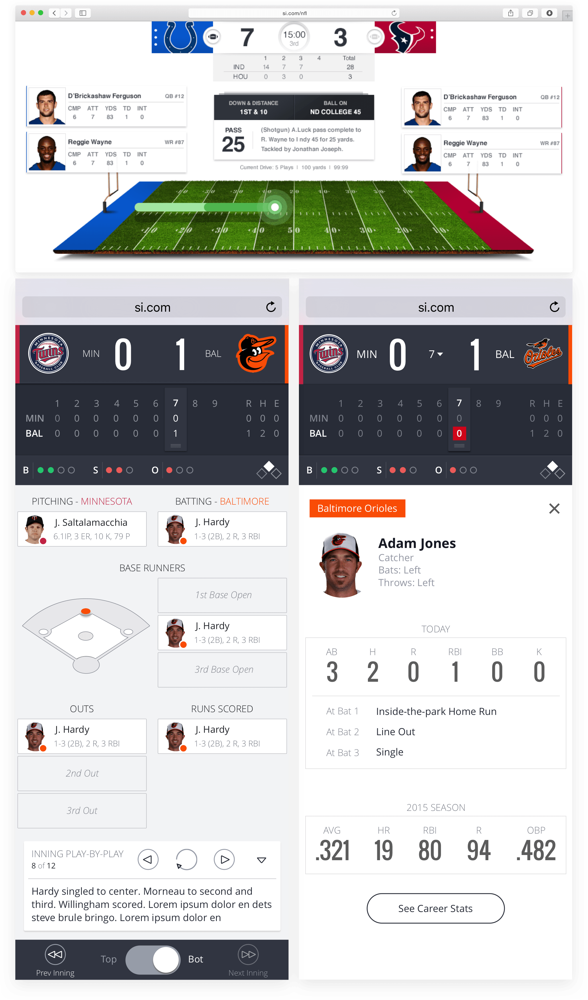

  <h1 class="headline">LiveFootball & Baseball</h1>
  
  <h4 class="date">June 2014-May 2015</h4>
  

    <h3>Problem</h3>
    
Wanting to reclaim ground as a leading sports destination, Sports Illustrated sought to improve its second screen experience in order to showcase the brand as more than just a magazine.

    <h3>Solution</h3>
    
Design and develop mobile-first game coverage by bringing two of America’s most popular sports, football and baseball, to life with fun and useful visualizations while events unfolded live on the field.

  

<section>
  <h2 class="bullet">My Role</h2>
  

    <video class="screencap" src="/assets/videos/gameflashScreencap.mp4" poster="/assets/img/projects/gameFlash/poster-liveFootage.jpg" controls></video>
    

      <h5 class="example">Studying the Tape</h5>
      
One of the trickest aspects of recreating a live game experience is accounting for all the edge cases and quirks that occur during the course of play. In order to design a robust experience, I immersed myself in both the sports data APIs and also spent hours watching the experience unfold alongside live video footage of the game.

    

  

  

    

      


      


      

        <video class="screencap" src="/assets/videos/gameflashPrototype.mov" poster="/assets/img/projects/gameFlash/poster-prototype.png" loop autoplay playsinline muted controls></video>
      

    

    

      <h5 class="example">High Fidelity Prototypes & User Research</h5>
      
I knew early and often usability testing was crucial to a successful product. At the same time, it was very important to us that the prototype feel as rich and as real as the end product. So I turned to <a href="https://framerjs.com/">Framer</a> to create a high fidelity prototype, which you can grab <a href="../assets/prototypes/mlbGameFlashPrototype.framer">here</a> (specifically scaled for the iPhone 5s that was used during testing).

    

  

  

    


    


    

      <h5 class="example">Statistical Analysis of Game Data</h5>
      
I knew lorem ipsum wasn't going to cut it while mocking up the interface. So, in order to design with realistic data, I performed statistical analysis of NFL and MLB game data over multiple seasons to understand the distribution of the most important UI data points. This helped our team anticipate the many edge cases of the experience.

    

  

</section>
